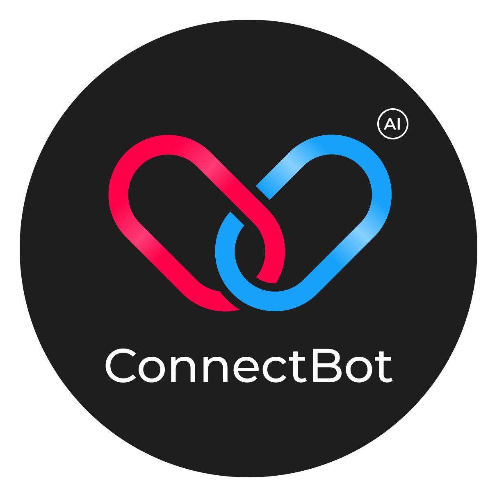

# ConnectBot

  

ConnectBot — это телеграм-бот на основе искусственного интеллекта для знакомства людей на основе общих интересов. Этот бот помогает находить собеседников, подходящих по интересам и целям общения, благодаря продвинутым алгоритмам подбора и ранжирования анкет.

## 📌 Основные возможности

### Создание анкеты
- **Ввод имени** — пользователи указывают свое имя для представления в боте.
- **Описание о себе** — пользователи могут добавить краткую информацию о себе.
- **Описание собеседника** — пользователи описывают, кого они хотят найти для общения.
- **Медиафайлы для анкеты** — добавление медиафайлов для создания привлекательного профиля.

### Редактирование анкеты
- Возможность обновить свой профиль в любое время

### Просмотр анкет пользователей
- **Ранжирование анкет** — анкеты сортируются по схожести с описанием желаемого собеседника, чтобы показать наиболее релевантных пользователей.
- **Листание анкет** — удобная навигация по анкетам с возможностью листать профили.
- **Вернуться к анкете по номеру** — быстрое возвращение к интересующему профилю через команду (например, `/1` для первой анкеты, `/2` для второй и так далее).

### Взаимодействие с другими пользователями
- **Лайки** — возможность "лайкнуть" анкету другого пользователя.
- **Уведомления о взаимных лайках** — если симпатия оказалась взаимной, то оба пользователя получают уведомление.
- **Обмен контактами** — при взаимном лайке пользователи получают ссылки друг друга на профиль в Telegram для дальнейшего общения.

## ⚙️ Дополнительные требования
- **Быстрый подбор релевантных пользователей** — система должна обеспечивать эффективный и своевременный поиск собеседников.
- **Обновление ранжирования** — актуализация рейтингов анкет при изменении описания желаемого собеседника.

## 🛠 Стек технологий и роли команды

**Backend**
- FastAPI
- PostgreSQL

**Data Science**
- ChromaDB
- Sentence Transformers

**Разработка Telegram-ботов**
- Aiogram

**UX/UI Дизайн**

**Тестировщик**

---

## 🚀 Быстрый старт
1. Клонируйте репозиторий.
2. Установите зависимости.
3. Настройте окружение (PostgreSQL, FastAPI).
4. Запустите бота

---

## 📄 Лицензия
Этот проект лицензирован на условиях MIT License.
